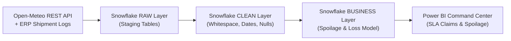
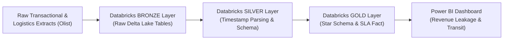
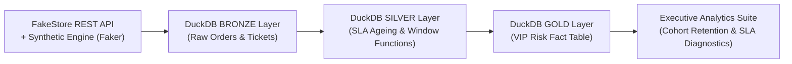

# Mirza Ishtiyaq Baig | Data Analyst

**CX & Operations Analytics · Cloud Data Architecture · SQL · Python · Power BI**

[LinkedIn](https://www.linkedin.com/in/mirzaishtiyaqbaig/) · [Email](mailto:mirzaishtiyaqbaig1@gmail.com) · Hyderabad, India · Open to Work

---

## About

Data Analyst with 2+ years embedded inside CX and technical support operations — not observing the data from a distance, but managing the workflows that generated it.

At Concentrix, I owned the analytical layer of a 2,000+ weekly case environment: building live data pipelines from Microsoft Fabric via Power Query, designing Power Pivot models consumed directly by the BI development team, and running case telemetry analysis that contributed to an 18% reduction in Tier-2 escalations. That operational grounding shapes how I frame analytical problems — I understand what SLA ageing, routing failures, and handle-time patterns mean before I open a query editor.

My project portfolio extends this into cloud data architecture — Medallion pipelines on Databricks, Snowflake-based data marts, Azure Synapse analytical models, and Python/SQL data engineering — each built on simulated or public operational datasets, and each held to one standard: **every claim in the writeup has to survive being checked against the underlying code and data.** Several of these projects turned up real issues on that kind of review — a revenue-inflating join bug, an unproven "root cause" that didn't survive a significance test, SQL demos that weren't actually reproducible against their own seed data — and each was fixed rather than smoothed over. That review trail is documented in every project's README, not hidden.

---

## Technical Stack

| Layer | Tools |
|---|---|
| **Cloud Platforms** | Snowflake · Databricks (Delta Lake) · Azure Synapse Analytics · Microsoft Fabric |
| **Architecture** | Medallion Architecture (Bronze/Silver/Gold) · Star Schema · ETL/ELT Pipelines |
| **SQL** | Advanced SQL (CTEs, Window Functions, JSON parsing) · T-SQL · Spark SQL · MySQL 8.0 · DuckDB |
| **Python** | Pandas · NumPy · Matplotlib · Seaborn · REST API Ingestion · Faker (synthetic data) |
| **BI & Reporting** | Power BI · DAX · Power Query · Exception Reporting · Executive Dashboards |
| **CX Domain** | Microsoft Dynamics 365 · SLA Governance · Case Telemetry · Ticket Lifecycle Analytics |

---

## Projects

### 1. [3PL Cold-Chain Spoilage & SLA Claim Engine](https://github.com/mirza-ishtiyaq/snowflake-pharma-logistics-pipeline)
**Stack:** Snowflake · Python · Open-Meteo REST API · Power BI

**Problem:** Cold-chain operations lack visibility into how weather conditions and 3PL carrier transit delays drive pharmaceutical spoilage risk — making it invisible until after the loss is booked.

**Process & Architecture Flow:**

**What I built:** A multi-layer Snowflake data mart (RAW → CLEAN → BUSINESS) joining 5,000 shipment records against live weather API data, with a per-carrier, per-product financial-loss model. Replicated the Snowflake SQL logic locally against the raw CSVs to independently re-verify every headline number: corrected a $1,000 typo in the total-loss figure, and ran an actual chi-square test on the "high-temperature + long-transit" root-cause claim the original analysis presented as proven — it turned out to be a mild, statistically insignificant signal (p≈0.41), not a confirmed driver. Also surfaced two real data-quality issues: the weather feed only covers half the shipment date range, and 124 shipment IDs carry genuinely conflicting duplicate records.

**Patterns demonstrated:** Multi-source data integration · Snowflake staging architecture · Statistical hypothesis testing · Correcting an unsupported causal claim instead of leaving it in

---

### 2. [E-Commerce Medallion Pipeline & Revenue Leakage Audit](https://github.com/mirza-ishtiyaq/databricks-medallion-architecture)
**Stack:** Databricks · Spark SQL · Delta Lake · Power BI

**Problem:** Fragmented e-commerce and logistics data with no unified analytical layer — causing slow BI reporting and business logic leaking into dashboards instead of being resolved at the data layer.

**Process & Architecture Flow:**

**What I built:** A full Bronze-Silver-Gold Medallion architecture over the public Olist Brazilian e-commerce dataset (~99K orders). Bronze ingests raw source data as Delta tables; Silver handles temporal normalization and null-key filtering; Gold builds an optimized star schema with pre-computed delivery-SLA flags and a dedicated lost-revenue fact table, pushing 90% of business logic upstream of Power BI. Cross-checked the dashboard's headline figures ($1.20M gross revenue, $97.24K/8.12% leakage, 12.3-day national transit) directly against the underlying screenshots — and caught a real labeling error: the 26-day logistics bottleneck state is Rondônia ("RO"), not Roraima ("RR") as the dashboard itself had mislabeled it.

**Patterns demonstrated:** Medallion architecture design · Delta Lake ACID transactions · Star schema modeling · Screenshot-grounded verification

---

### 3. [CX Support Ticket Lifecycle & SLA Breach Diagnostic Engine](https://github.com/mirza-ishtiyaq/e-commerce-etl-pipeline)
**Stack:** DuckDB · Python (Faker, Pandas) · SQL

**Problem:** Support and fulfillment teams need to know which high-value customers are experiencing SLA breaches before it shows up as churn.

**Process & Architecture Flow:**

**What I built:** A seeded, fully deterministic synthetic-data ELT pipeline (1M orders, 1M support tickets, 50K customers) through a Bronze→Silver→Gold DuckDB warehouse, with a window-function-based cohort retention analysis layered on top of the KPI reporting. Re-ran the entire pipeline end-to-end for this review and confirmed every headline figure reproduces exactly — the one project in this portfolio built for full, byte-for-byte reproducibility rather than a single point-in-time analysis.

**Patterns demonstrated:** Deterministic/seeded synthetic data generation · Medallion ELT in DuckDB · Window-function cohort retention · SLA/VIP risk modeling

---

## Domain Focus

**CX & Operations Analytics**
SLA governance · case telemetry · ticket lifecycle reporting · handle-time analysis · CRM data quality · WISMO

**Supply Chain & Logistics Analytics**
Cold-chain risk modelling · transit delay analytics · order fulfilment analytics · 3PL performance reporting

**Cloud Data Architecture**
Medallion pipeline design · Snowflake data mart engineering · Azure Synapse modelling · Delta Lake · star schema · environmental/public-sector analytics

---

## Let's Connect

- **LinkedIn:** [linkedin.com/in/mirzaishtiyaqbaig](https://www.linkedin.com/in/mirzaishtiyaqbaig/)
- **Email:** mirzaishtiyaqbaig1@gmail.com
- **Location:** Hyderabad, India · Open to pan-India or remote roles
