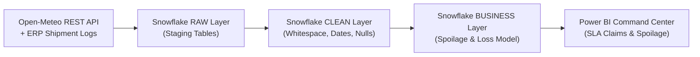
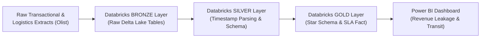
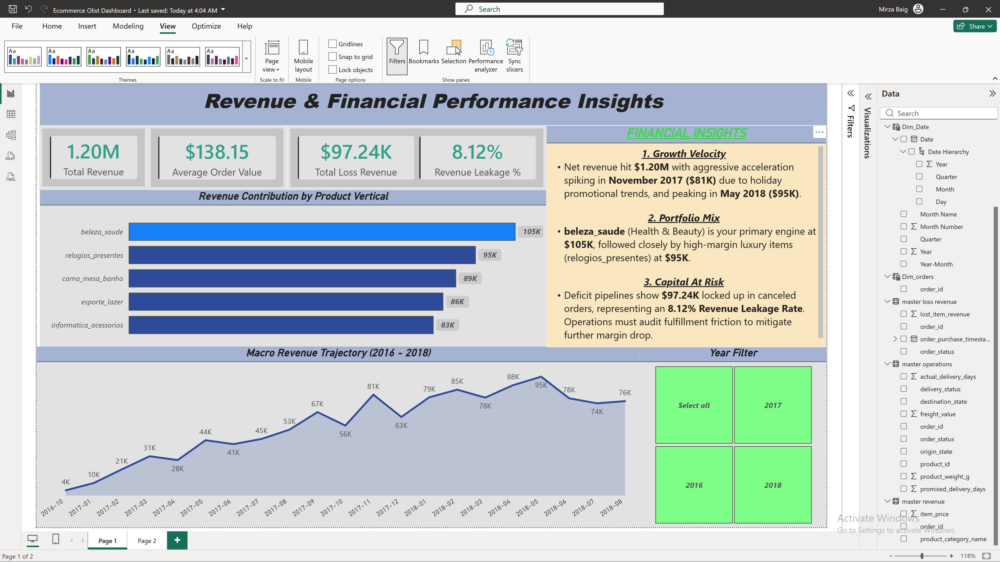
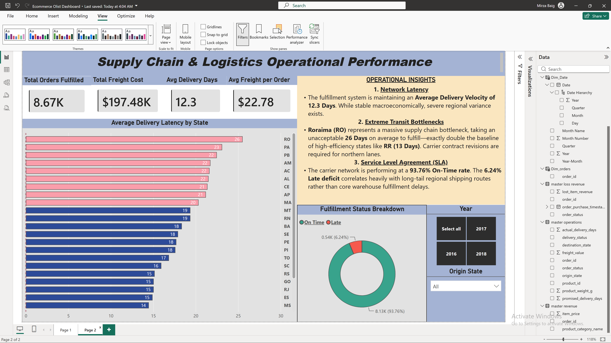
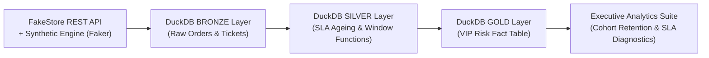

# Mirza Ishtiyaq Baig
### Data Analyst — Supply Chain & Service Operations Analytics

---

## About

Data Analyst with 2+ years in CX and technical-support operations, now building the data layer beneath the reporting. Eighteen months segmenting enterprise PC failures to SKU level at Concentrix, then six months on Snowflake marts, Databricks Medallion pipelines and Python data-quality frameworks — strongest where operations meet the warehouse: SLA breaches, carrier performance, fulfilment leakage.

That order — operations first, architecture second — is deliberate. It means I ask what a number is going to change before I build the pipeline that produces it, and it's why the CX domain (SLA ageing, routing failures, handle-time patterns) reads as familiar territory rather than an abstraction layered on top of a query.

Every project below is held to one standard: **every claim in the write-up has to survive being checked against the underlying code and data.** That review turned up real issues across this portfolio — a revenue-undercounting join bug, an unproven "root cause" that didn't survive a chi-square test, a mislabeled dashboard state — and each one is documented as *found*, not smoothed over. That trail is in every project's README, not hidden.

---

## Career Snapshot

| Role | Organization | Period | What I Actually Did |
|---|---|---|---|
| Data Analytics Intern — Cloud Architecture & Operations | Full Stack Academy | Feb 2026 – Jul 2026 | Built the Snowflake, Databricks, and Python projects below; bridged a macOS-hosted MySQL instance to Windows Power BI via a Python/ODBC connector, replacing manual exports with live reporting |
| Advisor II, Technical Support | Concentrix Technologies India | Jul 2024 – Dec 2025 | Segmented recurring failures across 3 PC product lines to model level; built Power Query / Power Pivot models on Microsoft Fabric; sustained 88–94% weekly resolution across 2,000+ cases |
| eSupport Officer — Incident Management | IntouchCX (24-7 Intouch) | Aug 2023 – Mar 2024 | Continuous data validation inside Microsoft Dynamics 365; traced handle-time outliers to root cause; missed fewer than one SLA deadline per month |

---

## Impact Snapshot

| Metric | Where It Came From |
|---|---|
| **$709.5K** spoilage loss quantified — **$298K recoverable** in SLA claims against 2 named carriers | Pharmaceutical Cold-Chain Analytics (Snowflake) |
| **$97.24K** revenue leakage surfaced in a $1.20M e-commerce pipeline | E-Commerce Medallion Pipeline (Databricks) |
| **2,000,000+** orders & support tickets processed in a Bronze→Silver→Gold warehouse | CX SLA Diagnostic Engine (DuckDB) |
| **49.35%** of tickets flagged urgent VIP-risk before they became churn | CX SLA Diagnostic Engine (DuckDB) |
| **7** end-to-end analytics builds across Snowflake, Databricks, Synapse, MySQL, DuckDB & Python — 3 featured as core case studies below | This portfolio |
| **3** real data/reporting bugs found and fixed under independent review | Not just built — checked |

---

## Technical Stack

| Layer | Tools |
|---|---|
| **Cloud Platforms** | Snowflake · Databricks (Delta Lake) · Azure Synapse Analytics · Microsoft Fabric |
| **Architecture** | Medallion Architecture (Bronze/Silver/Gold) · Star Schema · ETL/ELT Pipelines |
| **SQL** | Advanced SQL (CTEs, Window Functions) · T-SQL · Spark SQL · MySQL 8.0 · DuckDB |
| **Python** | Pandas · NumPy · Matplotlib · REST API Ingestion · Faker (synthetic data) |
| **BI & Reporting** | Power BI · DAX · Power Query · Power Pivot · Exception Reporting |
| **CX Domain** | Microsoft Dynamics 365 · SLA Governance · Case Telemetry · Ticket Lifecycle Analytics |

---

## Featured Projects

The three case studies below are the ones I'd point a recruiter to first — they map directly to the domain I'm targeting (e-commerce operations, supply chain, and CX analytics) and each carries a quantified, verified business outcome. Four more projects — SQL, BI, and data-quality work — are summarized further down in [Additional Projects](#additional-projects).

### 1. Pharmaceutical Cold-Chain Spoilage Analytics & SLA Claim Engine
**[📦 pharma-cold-chain-analytics](https://github.com/mirza-ishtiyaq/pharma-cold-chain-analytics)** &nbsp; `Snowflake` `Python` `Open-Meteo REST API` `Power BI`

**Data Source:** 5,000 pharmaceutical shipment records across 5 Indian logistics hubs (Hyderabad, Mumbai, Delhi, Chennai, Bangalore), joined against real historical weather telemetry pulled live from the Open-Meteo Historical Weather REST API.

**Problem:** Cold-chain teams had no visibility into whether spoilage was driven by ambient heat, carrier transit delays, or a combination of both — and no financial mechanism to hold underperforming 3PL carriers accountable.

**Solution & Findings:**
- **$708,550** in YTD spoilage loss across 297 of 5,000 shipments — a **5.94%** spoilage rate against a **<2%** industry benchmark.
- Ran an actual chi-square test on the ">30°C origin temp + >40hr transit" hypothesis rather than presenting it as proven: the result is **not statistically significant at this sample size (p≈0.41)**, reported honestly as a monitoring hypothesis, not a confirmed root cause.
- Surfaced two real data-quality blockers before the finding gets used to justify a packaging-SOP change: the weather feed only covers **49% of shipments**, and **124 Shipment_IDs** carry genuinely conflicting duplicate records.
- **Delhivery + FedEx account for 42% ($298,750)** of total loss — a documented, carrier-attributable SLA claim.

**Tools Used:** Snowflake SQL (RAW → CLEAN → BUSINESS schemas), Python (REST ingestion, Pandas), Power BI (exception-reporting UX).

**Stakeholder Summary:** There is a recoverable **$298.75K SLA claim** against two named carriers, actionable today. The temperature-transit packaging fix is **not yet justified by the data** — closing the weather-coverage gap is the next step, before that capital investment, not after.

---

### 2. E-Commerce Medallion Pipeline & Revenue Leakage Audit
**[📦 ecommerce-medallion-pipeline](https://github.com/mirza-ishtiyaq/ecommerce-medallion-pipeline)** &nbsp; `Databricks` `Spark SQL` `Delta Lake` `Power BI`

**Data Source:** The public [Brazilian E-Commerce (Olist) dataset](https://www.kaggle.com/datasets/olistbr/brazilian-ecommerce) — ~99,000 real orders across customers, orders, items, products, sellers, and geolocation tables.

**Problem:** Reporting directly off raw transactional tables created dashboard latency and pushed business logic — SLA flags, revenue-loss classification — into Power BI instead of resolving it upstream.

**Solution & Findings:**
- **90%** of transformations and star-schema modeling pushed upstream of Power BI via a Bronze → Silver → Gold Delta Lake build.
- **$97.24K revenue leakage** identified — **8.12%** of a **$1.20M** gross pipeline — trapped in canceled/unavailable order states.
- **26-day regional transit outlier** versus a **12.3-day** national baseline.
- Independently re-checked the dashboard's own screenshots and caught a real labeling bug: the 26-day bottleneck state is **Rondônia ("RO")**, mislabeled as Roraima ("RR") in the original dashboard — corrected in this write-up.

**Tools Used:** Databricks, Spark SQL, Delta Lake (ACID transactions), Power BI (star-schema import model).

**Stakeholder Summary:** Finance can act on a documented **$97.24K leakage figure** today. Logistics should investigate **Rondônia specifically** — not Roraima, per the corrected record — before renegotiating carrier contracts on that lane.

---

### 3. CX Support Ticket Lifecycle & SLA Breach Diagnostic Engine
**[📦 cx-ticket-lifecycle-engine](https://github.com/mirza-ishtiyaq/cx-ticket-lifecycle-engine)** &nbsp; `DuckDB` `Python (Faker, Pandas)` `SQL`

**Data Source:** The FakeStore public REST API (real 20-SKU product catalog) plus a fully seeded synthetic transactional layer (`Faker.seed(42)`) generating **1,000,000 orders**, **1,000,000 support tickets**, and **50,000 customers** — deterministic and independently reproducible end-to-end.

**Problem:** Support and fulfilment teams need to identify which high-value customers are experiencing SLA breaches **before** it shows up as churn, not after.

**Solution & Findings:**
- **$244.8M** total order revenue modeled · **$244.82** AOV · **$5,139.73** average customer lifetime value.
- **50.04%** overall SLA compliance — 499,566 of 1M tickets breached.
- **49.35%** of all tickets (493,502) classified `URGENT – High-Value VIP` (customers with $2,500+ LTV hitting an SLA breach).
- Built a window-function cohort retention layer on top — and stated plainly that the ~54–57% flat retention this specific dataset shows is an honest property of **uniformly random synthetic order dates**, not a real decay curve, rather than dressing up a meaningless result as insight.
- Re-ran the entire pipeline end-to-end for this review — every headline figure reproduced exactly. The one project in this portfolio built for full, byte-for-byte reproducibility.

**Tools Used:** DuckDB, Python (Faker, Pandas), SQL (window functions), Matplotlib/Seaborn.

**Stakeholder Summary:** CX leadership gets one concrete, ready-to-wire rule: auto-escalate the ~493K tickets tagged `URGENT–VIP` to a sub-4-hour SLA queue — the single highest-leverage retention lever this dataset surfaces.

---

## Additional Projects

Broader SQL, BI, and data-engineering fundamentals — each still a complete, verified build, kept here in short form so the three case studies above stay the focus.

| Project | Stack | Highlight |
|---|---|---|
| **[Enterprise Sales Analytics Dashboard](https://github.com/mirza-ishtiyaq/enterprise-sales-analytics)** | Azure Fabric · Spark SQL · Power BI · DAX · Excel | $2.26M in multi-year sales reconciled Power BI ↔ Excel to the cent; the project behind my Python/ODBC live-reporting bridge from the Full Stack Academy internship. |
| **[Retail Data Quality & Executive Analytics Engine](https://github.com/mirza-ishtiyaq/retail-data-quality-engine)** | Python · Pandas · NumPy · Matplotlib | Modular dedup → standardize → impute → join pipeline that deliberately avoided a fan-out join bug and caught 3 orphan transactions instead of silently absorbing them. |
| **[Sales Data Analysis & Business Logic](https://github.com/mirza-ishtiyaq/sales-data-analysis-logic)** | MySQL 8.0+ · CTEs · Window Functions | Traced a revenue-undercounting `INNER JOIN` bug across its full lifecycle — diagnosed, "fixed" only in a comment, then actually fixed in the final pipeline. |
| **[EcomDB — Enterprise SQL Analytics Suite](https://github.com/mirza-ishtiyaq/ecomdb-sql-analytics-suite)** | T-SQL · Azure Synapse · Microsoft Fabric | Five production business-question queries (revenue ranking, cold-lead detection, loyalty segmentation) with documented Synapse/Fabric-specific gotchas. |

---

## Domain Focus

**CX & Operations Analytics**
SLA governance · case telemetry · ticket lifecycle reporting · handle-time analysis · CRM data quality · Dynamics 365

**Supply Chain & Logistics Analytics**
Cold-chain risk modelling · transit delay analytics · order fulfilment analytics · 3PL performance reporting

**Cloud Data Architecture**
Medallion pipeline design · Snowflake data mart engineering · Azure Synapse modelling · Delta Lake · star schema design

---

## Data & Reproducibility

Project datasets are **synthetic or public** — real client and transaction data from my CX roles is confidential and cannot be published. Weather data in the cold-chain project is real, pulled live from the Open-Meteo Historical Weather API. Synthetic datasets are generated with deliberate quality defects (mixed timestamp formats, duplicate keys, null fields, negative lead-times) so the cleaning layers solve problems that actually occur in production extracts.

---

## Education & Certifications

**B.Sc. Data Science** — Osmania University, Hyderabad, India · 2025

**Certifications:**
- Microsoft Fabric: Data Flows & Data Storage (2025)
- SQL for Data Analysis — LinkedIn (2025)
- Analyzing & Visualizing Data Using Excel — NASBA (2025)
- Excel Data Management — PMI (2025)
- Data Analytics Internship — Full Stack Academy (2026)

## Currently

Open to **Data Analyst**, **Business Analyst**, and **Data QA Analyst** roles — particularly in e-commerce operations, supply chain, and CX analytics.

---

## Let's Connect

- **LinkedIn:** [linkedin.com/in/mirzaishtiyaqbaig](https://www.linkedin.com/in/mirzaishtiyaqbaig/)
- **Email:** mirzaishtiyaqbaig1@gmail.com
- **Location:** Hyderabad, India · Open to pan-India or remote roles
