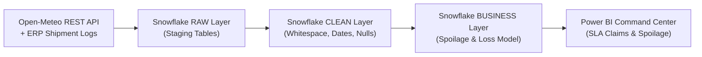
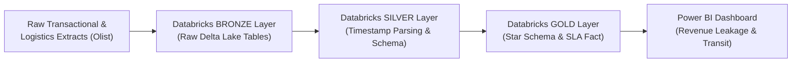
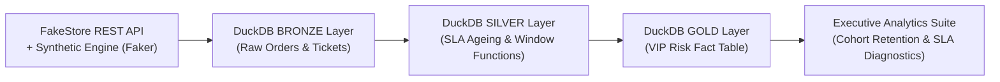
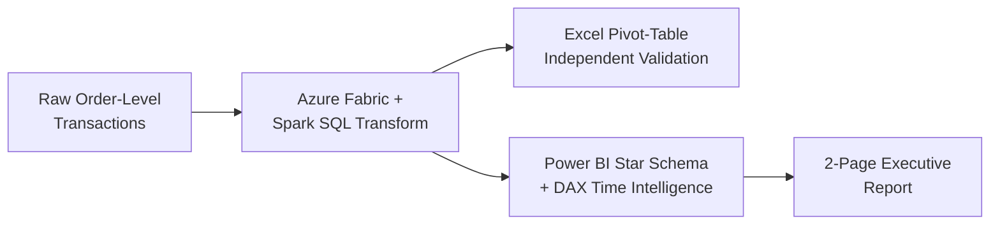
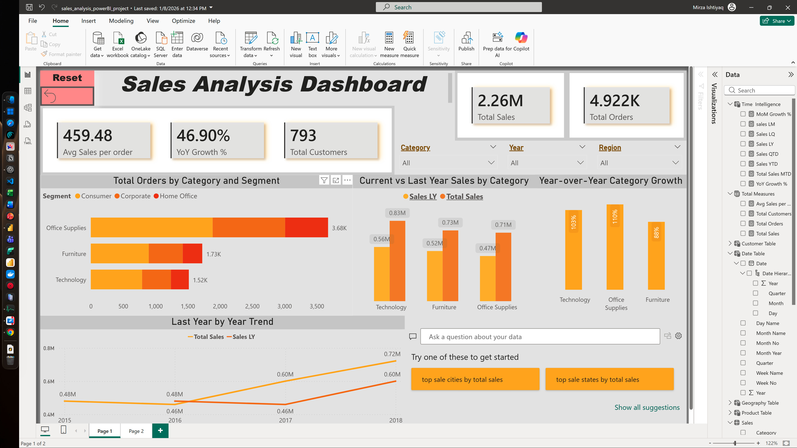
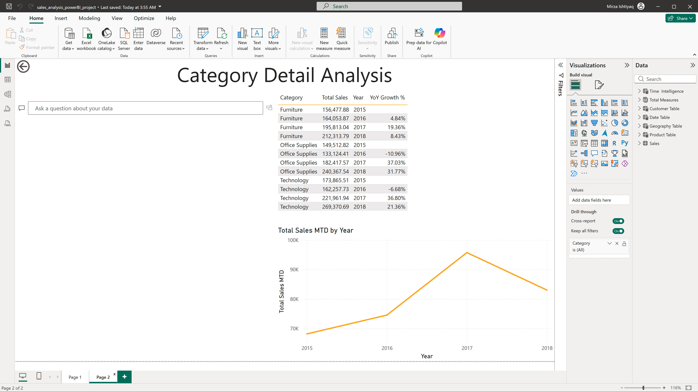
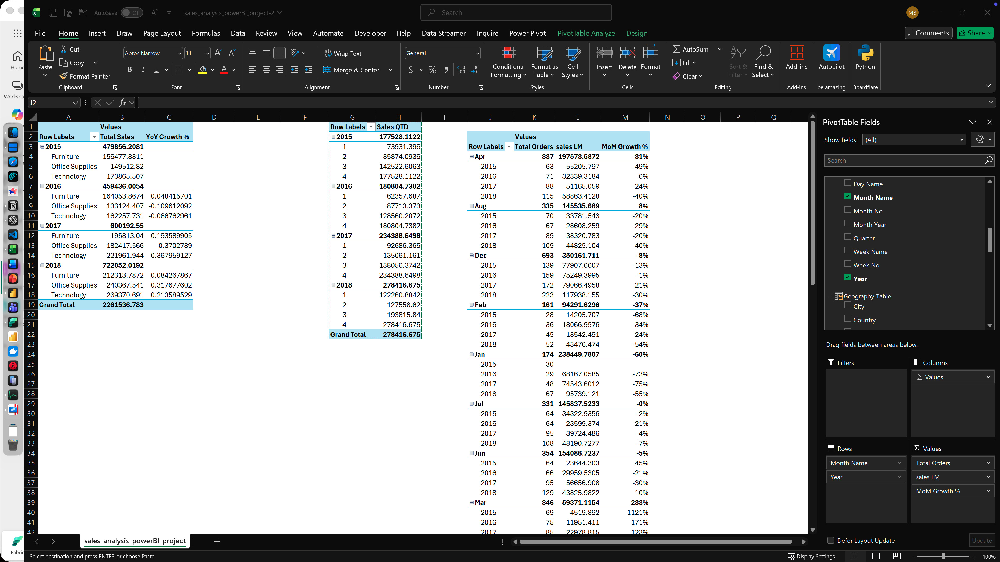
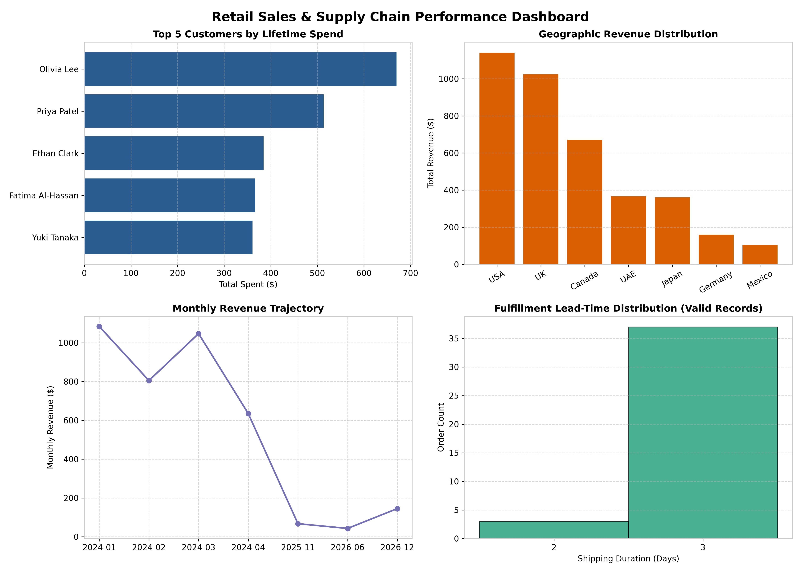

# Mirza Ishtiyaq Baig
### Data Analyst — CX Operations & E-Commerce Analytics

---

## About

Data Analyst with 2.5+ years bridging CX operations and cloud analytics for e-commerce and fulfilment environments. I spent 18 months inside HP's PC support queue (via Concentrix Technologies), segmenting recurring failures down to model level and separating hardware defects from software regressions before escalating structured technical queries to engineering — before moving into a cloud analytics internship at **Full Stack Academy** to build the engineering layer underneath: Snowflake data marts, Databricks Medallion pipelines, a Python data-quality framework, and a live Power BI reporting layer bridged over Python/ODBC.

That order — operations first, architecture second — is deliberate. It means I ask what a number is going to change before I build the pipeline that produces it, and it's why the CX domain (SLA ageing, routing failures, handle-time patterns) reads as familiar territory rather than an abstraction layered on top of a query.

Every project below is held to one standard: **every claim in the write-up has to survive being checked against the underlying code and data.** That review turned up real issues across this portfolio — a revenue-undercounting join bug, an unproven "root cause" that didn't survive a chi-square test, a mislabeled dashboard state — and each one is documented as *found*, not smoothed over. That trail is in every project's README, not hidden.

---

## Career Snapshot

| Role | Organization | Period | What I Actually Did |
|---|---|---|---|
| Data Analytics Intern — Cloud Architecture & Operations | Full Stack Academy | Feb 2026 – Jul 2026 | Built the Snowflake, Databricks, and Python projects below; bridged a macOS-hosted MySQL instance to Windows Power BI via a Python/ODBC connector, replacing manual exports with live reporting |
| Data Analyst / Advisor II — CX Operations | Concentrix Technologies (HP account) | Jul 2024 – Dec 2025 | Segmented recurring failures across 3 PC product lines to model level; built Power Query / Power Pivot models on Microsoft Fabric; sustained 88–94% weekly resolution across 2,000+ cases |
| eSupport Officer — Incident Management | IntouchCX (24-7 Intouch) | Aug 2023 – Mar 2024 | Continuous data validation inside Microsoft Dynamics 365; traced handle-time outliers to root cause; missed fewer than one SLA deadline per month |

---

## Impact Snapshot

| Metric | Where It Came From |
|---|---|
| **$709.5K** spoilage loss quantified, traced to 2 named carriers | Pharmaceutical Cold-Chain Analytics (Snowflake) |
| **$97.24K** revenue leakage surfaced in a $1.20M e-commerce pipeline | E-Commerce Medallion Pipeline (Databricks) |
| **2,000,000+** orders & support tickets processed in a Bronze→Silver→Gold warehouse | CX SLA Diagnostic Engine (DuckDB) |
| **$2.26M** in multi-year sales reconciled Power BI ↔ Excel to the cent | Enterprise Sales Dashboard (Power BI) |
| **7** end-to-end analytics builds across Snowflake, Databricks, Synapse, MySQL, DuckDB & Python | This portfolio |
| **3** real data/reporting bugs found and fixed under independent review | Not just built — checked |

---

## Technical Stack

| Layer | Tools |
|---|---|
| **Cloud Platforms** | Snowflake · Databricks (Delta Lake) · Azure Synapse Analytics · Microsoft Fabric |
| **Architecture** | Medallion Architecture (Bronze/Silver/Gold) · Star Schema · ETL/ELT Pipelines |
| **SQL** | Advanced SQL (CTEs, Window Functions) · T-SQL · Spark SQL · MySQL 8.0 · DuckDB |
| **Python** | Pandas · NumPy · Matplotlib · REST API Ingestion · Faker (synthetic data) |
| **BI & Reporting** | Power BI · DAX · Power Query · Power Pivot · Exception Reporting |
| **CX Domain** | Microsoft Dynamics 365 · SLA Governance · Case Telemetry · Ticket Lifecycle Analytics |

---

## Featured Projects

### 1. Pharmaceutical Cold-Chain Spoilage Analytics & SLA Claim Engine
**[Repository →](https://github.com/mirza-ishtiyaq/snowflake-pharma-logistics-pipeline)** &nbsp; `Snowflake` `Python` `Open-Meteo REST API` `Power BI`

**Data Source:** 5,000 pharmaceutical shipment records across 5 Indian logistics hubs (Hyderabad, Mumbai, Delhi, Chennai, Bangalore), joined against real historical weather telemetry pulled live from the Open-Meteo Historical Weather REST API.

**Problem:** Cold-chain teams had no visibility into whether spoilage was driven by ambient heat, carrier transit delays, or a combination of both — and no financial mechanism to hold underperforming 3PL carriers accountable.

**Solution & Findings:**
- **$708,550** in YTD spoilage loss across 297 of 5,000 shipments — a **5.94%** spoilage rate against a **<2%** industry benchmark.
- Ran an actual chi-square test on the ">30°C origin temp + >40hr transit" hypothesis rather than presenting it as proven: the result is **not statistically significant at this sample size (p≈0.41)**, reported honestly as a monitoring hypothesis, not a confirmed root cause.
- Surfaced two real data-quality blockers before the finding gets used to justify a packaging-SOP change: the weather feed only covers **49% of shipments**, and **124 Shipment_IDs** carry genuinely conflicting duplicate records.
- **Delhivery + FedEx account for 42% ($298,750)** of total loss — a documented, carrier-attributable SLA claim.

**Tools Used:** Snowflake SQL (RAW → CLEAN → BUSINESS schemas), Python (REST ingestion, Pandas), Power BI (exception-reporting UX).

**Stakeholder Summary:** There is a recoverable **$298.75K SLA claim** against two named carriers, actionable today. The temperature-transit packaging fix is **not yet justified by the data** — closing the weather-coverage gap is the next step, before that capital investment, not after.

---

### 2. E-Commerce Medallion Pipeline & Revenue Leakage Audit
**[Repository →](https://github.com/mirza-ishtiyaq/databricks-medallion-architecture)** &nbsp; `Databricks` `Spark SQL` `Delta Lake` `Power BI`

**Data Source:** The public [Brazilian E-Commerce (Olist) dataset](https://www.kaggle.com/datasets/olistbr/brazilian-ecommerce) — ~99,000 real orders across customers, orders, items, products, sellers, and geolocation tables.

**Problem:** Reporting directly off raw transactional tables created dashboard latency and pushed business logic — SLA flags, revenue-loss classification — into Power BI instead of resolving it upstream.

**Solution & Findings:**
- **90%** of transformations and star-schema modeling pushed upstream of Power BI via a Bronze → Silver → Gold Delta Lake build.
- **$97.24K revenue leakage** identified — **8.12%** of a **$1.20M** gross pipeline — trapped in canceled/unavailable order states.
- **26-day regional transit outlier** versus a **12.3-day** national baseline.
- Independently re-checked the dashboard's own screenshots and caught a real labeling bug: the 26-day bottleneck state is **Rondônia ("RO")**, mislabeled as Roraima ("RR") in the original dashboard — corrected in this write-up.

**Tools Used:** Databricks, Spark SQL, Delta Lake (ACID transactions), Power BI (star-schema import model).

**Stakeholder Summary:** Finance can act on a documented **$97.24K leakage figure** today. Logistics should investigate **Rondônia specifically** — not Roraima, per the corrected record — before renegotiating carrier contracts on that lane.

---

### 3. CX Support Ticket Lifecycle & SLA Breach Diagnostic Engine
**[Repository →](https://github.com/mirza-ishtiyaq/e-commerce-etl-pipeline)** &nbsp; `DuckDB` `Python (Faker, Pandas)` `SQL`

**Data Source:** The FakeStore public REST API (real 20-SKU product catalog) plus a fully seeded synthetic transactional layer (`Faker.seed(42)`) generating **1,000,000 orders**, **1,000,000 support tickets**, and **50,000 customers** — deterministic and independently reproducible end-to-end.

**Problem:** Support and fulfilment teams need to identify which high-value customers are experiencing SLA breaches **before** it shows up as churn, not after.

**Solution & Findings:**
- **$244.8M** total order revenue modeled · **$244.82** AOV · **$5,139.73** average customer lifetime value.
- **50.04%** overall SLA compliance — 499,566 of 1M tickets breached.
- **49.35%** of all tickets (493,502) classified `URGENT – High-Value VIP` (customers with $2,500+ LTV hitting an SLA breach).
- Built a window-function cohort retention layer on top — and stated plainly that the ~54–57% flat retention this specific dataset shows is an honest property of **uniformly random synthetic order dates**, not a real decay curve, rather than dressing up a meaningless result as insight.
- Re-ran the entire pipeline end-to-end for this review — every headline figure reproduced exactly. The one project in this portfolio built for full, byte-for-byte reproducibility.

**Tools Used:** DuckDB, Python (Faker, Pandas), SQL (window functions), Matplotlib/Seaborn.

**Stakeholder Summary:** CX leadership gets one concrete, ready-to-wire rule: auto-escalate the ~493K tickets tagged `URGENT–VIP` to a sub-4-hour SLA queue — the single highest-leverage retention lever this dataset surfaces.

---

### 4. Enterprise Sales Analytics Dashboard
**[Repository →](https://github.com/mirza-ishtiyaq/PowerBI_Sales_analysis_dashboard)** &nbsp; `Azure Fabric` `Spark SQL` `Power BI` `DAX` `Excel`

**Data Source:** A 4-year (2015–2018) retail/B2B order-level dataset spanning 3 product categories (Furniture, Office Supplies, Technology) and 3 customer segments (Consumer, Corporate, Home Office).

**Problem:** Leadership needed a five-minute read on whether growth was accelerating or just a bounce-back from a weak prior year, and which category was actually driving it.

**Solution & Findings:**
- **$2.26M** total sales · **4,922** orders · **$459.48** avg sales/order · **793** customers · **46.90% YoY growth** — reconciled to the cent against an independently built Excel pivot (**$2,261,536.78** grand total).
- Caught that the headline 46.90% YoY figure sits on top of a **2016 dip** (revenue fell 2015→2016 before rebounding in 2017–2018) — flagged as partly a recovery story, not pure acceleration.
- Order volume and revenue rank categories **differently**: Office Supplies leads on order count (3.68K) but Technology leads on 2018 revenue ($269.4K) — a lower-frequency, higher-ticket category.
- Documented that full-year growth masks in-year softening — the Total Sales MTD trend peaked in 2017 and pulled back in 2018, despite 2018 being the strongest full year on record.

**Tools Used:** Azure Fabric, Spark SQL, Power BI (DAX time-intelligence, star schema), Excel (pivot-table validation).

**Stakeholder Summary:** The 46.90% growth headline is real but partly a rebound off 2016. Read **Technology as the highest-*value*, not highest-*volume*, category**, and treat Furniture — steady but slowest-growing — as the one category needing a distinct growth strategy.

---

### 5. Retail Data Quality & Executive Analytics Engine
**[Repository →](https://github.com/mirza-ishtiyaq/python-data-quality-engine)** &nbsp; `Python` `Pandas` `NumPy` `Matplotlib`

**Data Source:** Three synthetic CRM/order/transaction extracts engineered with realistic production defects — duplicate primary keys, inconsistent country strings, missing contact fields, negative lead-times, and orphaned transaction records.

**Problem:** Retail data fragmented across CRM, fulfilment, and payment systems obscures true revenue and delivery performance — and a naive join here silently inflates revenue.

**Approach:** A modular Python/Pandas pipeline — deduplicate → standardize → impute → join → anomaly-flag — with every step printing a before/after row-count audit.

**Solution & Findings:**
- Deduplication, country-string standardization, and non-destructive imputation applied via reusable, auditable functions.
- Deliberately avoided a fan-out trap: `transactions` has no `order_id`, so joining it in on `customer_id` alone would cross-multiply every order by every transaction per customer and silently inflate summed revenue. Instead, transactions were validated **independently** against the customer master — surfacing **3 orphan transactions** ($100,000, $95,500, -$150) tied to customer IDs that don't exist anywhere, excluded rather than joined in.
- **$78.08** AOV · **$107.77** ATV · **$3,826.12** total gross revenue · **2.92-day** average clean shipping lead-time · **9** negative-lead-time records flagged for IT sync review (kept, not dropped).

**Tools Used:** Python, Pandas, NumPy, Matplotlib, Jupyter.

**Stakeholder Summary:** Ops gets a clean, audited revenue and SLA baseline plus a **named list** of 9 sync-error orders and 3 corrupted gateway transactions to route back to IT — not a report that silently absorbed the bad records into the totals.

---

### 6. Sales Data Analysis & Business Logic (MySQL)
**[Repository →](https://github.com/mirza-ishtiyaq/Sales_Analysis.SQL)** &nbsp; `MySQL 8.0+` `CTEs` `Window Functions`

**Data Source:** A `sales_analysis` MySQL schema (customers/orders/transactions) — query and pipeline logic only, documented explicitly as a portfolio artifact against an assumed schema rather than a clone-and-run demo.

**Problem:** Turn messy source data into trustworthy, queryable BI views (revenue, top customers, MoM growth, shipping SLA) — and catch a bug an earlier pass had already silently shipped.

**Approach:** A 5-phase SQL evolution — `00` legacy exploratory script → `01` cleaning → `02` standardization → `03` analytical views → `04` consolidated, corrected pipeline.

**Solution & Findings:**
- Traced one bug across its **full lifecycle**: `vw_total_revenue` used an `INNER JOIN` that silently dropped 3 unmatched orders from every revenue total. The legacy script's own comment claimed the fix had shipped — but the code still read `INNER JOIN`. The actual fix (`LEFT JOIN`) only landed in the final consolidated pipeline (`04`).
- Fixed a non-deterministic dedup: `ROW_NUMBER() OVER (PARTITION BY customer_id ORDER BY customer_id)` was a no-op tie-break; reordered by `created_date DESC` for a real, reproducible keep-rule.
- Month-over-Month growth via `LAG()`, shipping SLA buckets (Fast/Normal/Slow/Flagged), plus a full manual dialect/logic correctness review documented directly in the README.

**Tools Used:** MySQL 8.0+, CTEs, Window Functions (`LAG`, `ROW_NUMBER`), Views as a BI semantic layer.

**Stakeholder Summary:** The revenue number stakeholders were shown before this review was **undercounted**. `04_complete_pipeline.sql` is the version to run — it's the only one where the fix that was already "documented" actually shipped.

---

### 7. EcomDB — Enterprise SQL Analytics Suite (Synapse/Fabric)
**[Repository →](https://github.com/mirza-ishtiyaq/azure-synapse-enterprise-analytics)** &nbsp; `T-SQL` `Azure Synapse` `Microsoft Fabric`

**Data Source:** A normalized 5-table e-commerce schema (customers, products, orders, reviews, inventory), seeded directly in the repository's own setup script — self-contained and runnable end-to-end.

**Problem:** Translate five concrete merchandising/marketing/ops questions into production-grade, cloud-warehouse-safe T-SQL — not textbook syntax drills.

**Approach:** Five documented business queries, each opening with the business question and closing with a trade-off note, run against the seeded schema.

**Solution & Findings:**
- **Q1:** `DENSE_RANK` (not `ROW_NUMBER`) for top-2-products-per-category — verified against seed data that two Appliance products genuinely tie at $900 revenue, and `DENSE_RANK` surfaces both instead of arbitrarily hiding one.
- **Q2:** `NOT EXISTS` (not `LEFT JOIN + IS NULL`) for cold-lead detection — chosen for short-circuit performance at real scale.
- **Q3:** An anchor-date arithmetic trick (row number − date) detects 3+ consecutive-day purchasers with a single `GROUP BY`, no self-join — verified against seed data.
- **Q4/Q5:** Loyalty-tier segmentation by days-to-second-purchase, with an explicit `HAVING COUNT(*) = 2` guard and a documented `DATEDIFF` midnight-boundary quirk solved via an hour-level `LEAD()` approach.
- A dedicated platform-notes table documents real Synapse/Fabric-specific gotchas (`DATETIME2` precision requirements, `ORDER BY`-in-CTE restrictions, unenforced constraints).

**Tools Used:** T-SQL, Azure Synapse Analytics, Microsoft Fabric Warehouse compatibility patterns.

**Stakeholder Summary:** Five ready-to-adapt query patterns — revenue ranking, re-engagement targeting, loyalty segmentation — that already account for the specific ways Synapse/Fabric differ from standard SQL Server, removing a debugging session most analysts hit on day one.

---

## Domain Focus

**CX & Operations Analytics**
SLA governance · case telemetry · ticket lifecycle reporting · handle-time analysis · CRM data quality · Dynamics 365

**Supply Chain & Logistics Analytics**
Cold-chain risk modelling · transit delay analytics · order fulfilment analytics · 3PL performance reporting

**Cloud Data Architecture**
Medallion pipeline design · Snowflake data mart engineering · Azure Synapse modelling · Delta Lake · star schema design

---

## Data & Reproducibility

Project datasets are **synthetic or public** — real client and transaction data from my CX roles is confidential and cannot be published. Weather data in the cold-chain project is real, pulled live from the Open-Meteo Historical Weather API. Synthetic datasets are generated with deliberate quality defects (mixed timestamp formats, duplicate keys, null fields, negative lead-times) so the cleaning layers solve problems that actually occur in production extracts.

---

## Currently

Open to **Data Analyst**, **Business Analyst**, and **Data QA Analyst** roles — particularly in e-commerce operations, supply chain, and CX analytics.

---

## Let's Connect

- **LinkedIn:** [linkedin.com/in/mirzaishtiyaqbaig](https://www.linkedin.com/in/mirzaishtiyaqbaig/)
- **Email:** mirzaishtiyaqbaig1@gmail.com
- **Location:** Hyderabad, India · Open to pan-India or remote roles
