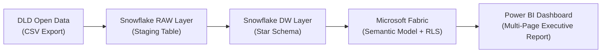
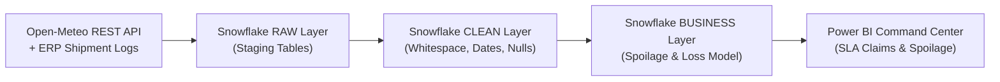
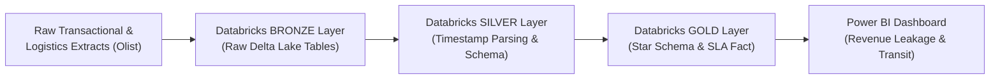
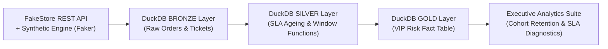

# Mirza Ishtiyaq Baig
### Data Analyst · BI Developer · Data Science Graduate

---

## About

**Data Analyst / BI Developer** with a B.Sc. in Data Science and 6 months of internship experience building production-grade analytics pipelines on **Snowflake**, **Databricks**, **Microsoft Fabric**, and **DuckDB**.

I specialize in Kimball-style star schemas, end-to-end cloud ELT pipelines, advanced SQL/DAX, and executive Power BI dashboards. My work focuses on quantifying business impact — surfacing **$666K in supply-chain losses**, **$97K in revenue leakage**, and building **Row-Level Security models** on real government open data.

Every project below pairs rigorous data transformations with verifiable business insights and metrics.

---

## Find What You Need

| If you're hiring for... | Start here |
|---|---|
| **Data Analyst** | [Internship Experience](#internship-experience) → [Technical Stack](#technical-stack) → [Featured Projects](#featured-projects) |
| **BI Developer** | [Technical Stack: BI & Reporting](#technical-stack) → [Featured Projects](#featured-projects) |
| **Business / Operations Analyst** | [Internship Experience](#internship-experience) → [Domain Focus](#domain-focus) → [Featured Projects](#featured-projects) |
| **Just want the numbers** | [Impact Snapshot](#impact-snapshot) |

---

## Internship Experience

### **Data Analytics Intern — Cloud Architecture & Operations**
**Full Stack Academy** · *Feb 2026 – Jul 2026*

- **End-to-End Cloud Pipelines:** Designed and implemented multi-stage ETL/ELT pipelines across **Snowflake**, **Databricks (Delta Lake Medallion Architecture)**, and **DuckDB** to ingest, clean, and model high-volume transactional and operational datasets.
- **Automated BI Integration:** Built a custom Python/ODBC connector bridging a macOS-hosted MySQL database directly to Power BI, eliminating manual CSV workflows and enabling live dashboard refresh.
- **Relational & Dimensional Modeling:** Architected star schemas, fact/dimension tables, and optimized SQL queries using CTEs and window functions to compute SLA metrics and revenue trends.
- **Executive Dashboarding:** Developed interactive Power BI dashboards utilizing advanced DAX measures, parameter-driven filtering, and drill-through capabilities to monitor carrier SLA compliance and customer ticket lifecycles.
- **Technical Mentorship:** Facilitated peer learning sessions on advanced SQL querying, data hygiene practices, and Power BI visualization standards for incoming cohort members.

---

## Education & Certifications

**🎓 Bachelor of Science (B.Sc.) in Data Science**  
*Osmania University, Hyderabad, India · 2025*

**📜 Professional Certifications & Completed Programs:**
- **Data Analytics Internship** — Full Stack Academy (2026)
- **Microsoft Fabric: Data Flows & Data Storage** — Microsoft (2025)
- **SQL for Data Analysis** — LinkedIn Learning (2025)
- **Analyzing & Visualizing Data Using Excel** — NASBA (2025)
- **Excel Data Management** — PMI (2025)

---

## Technical Stack

| Layer | Tools & Technologies |
|---|---|
| **Cloud Platforms & Warehouses** | Snowflake · Databricks (Delta Lake) · Azure Synapse Analytics · Microsoft Fabric · DuckDB |
| **Data Warehousing & Modeling** | Medallion Architecture (Bronze/Silver/Gold) · Star Schema · Dimensional Modelling · ETL/ELT Pipelines |
| **SQL & Database Engines** | Advanced SQL (CTEs, Window Functions) · T-SQL · Spark SQL · PostgreSQL · MySQL 8.0 · Data Validation |
| **Python & Data Engineering** | Pandas · NumPy · SQLAlchemy · Matplotlib · Seaborn · REST API Ingestion|
| **BI & Analytics Visualization** | Power BI · DAX · Power Query · Power Pivot · Interactive Visualizations · Automated Refresh · KPI Design |
| **Spreadsheets & Developer Tools** | Advanced Excel (XLOOKUP, Pivot Tables, Power Pivot) · Git / GitHub · VS Code · Jupyter Notebooks |

---

## Featured Projects

Four end-to-end case studies spanning real government open data, pharmaceutical logistics, e-commerce revenue operations, and customer lifecycle analytics. Additional projects are summarized in [Additional Projects](#additional-projects).

### 1. Dubai Real Estate Enterprise BI Pipeline
**[🏗️ dubai-real-estate-analytics](https://github.com/mirza-ishtiyaq/dubai-real-estate-analytics)** &nbsp; `Snowflake` `Microsoft Fabric` `Power BI` `Python` `DAX` `Row-Level Security`

**Data Source:** 140,000+ real property transactions from the [Dubai Land Department (DLD)](https://dubailand.gov.ae/en/open-data/real-estate-data/) government open data portal — not synthetic, not seeded.

**Problem:** Raw DLD CSV exports needed to be transformed into a governed, enterprise-grade data warehouse with proper dimensional modeling, automated ingestion, and role-based dashboard access.

## 📸 Dashboard Preview

  

<b>View all dashboard pages</b>

    
    
    
    
  

**Solution & Findings:**
- Designed a **Kimball star schema** with **5 dimension tables** and **1 fact table** — every table has documented grain, source, and cleaning rationale in SQL comments.
- Built a **Python incremental loader** using Snowflake PUT + COPY INTO for efficient bulk ingestion with BOM-aware CSV parsing.
- Implemented **Row-Level Security (RLS)** in Microsoft Fabric via a DAX bridge table, enabling multi-tenant dashboard access.
- Made deliberate, documented data modeling decisions: dropped 3 columns (50–70% null), separated two types of null in DIM_ROOMS (structural N/A vs. data capture gap), used TRY_TO_* defensive casts throughout.
- Covered **272 geographic areas**, **140K+ transaction line-items**, and all property types across Dubai's real estate market.

**Tools Used:** Snowflake SQL (star schema DDL), Python (snowflake-connector-python, Pandas), Microsoft Fabric (DirectQuery semantic model), Power BI (DAX measures, RLS, custom theme).

---

### 2. Cold-Chain Spoilage & Carrier SLA Recovery Engine
**[📦 pharma-cold-chain-analytics](https://github.com/mirza-ishtiyaq/pharma-cold-chain-analytics)** &nbsp; `Snowflake` `Python` `Open-Meteo REST API` `Power BI`

**Data Source:** 5,000 pharmaceutical shipment records across 5 Indian logistics hubs (Hyderabad, Mumbai, Delhi, Chennai, Bangalore), joined against historical weather telemetry pulled live from the Open-Meteo Historical Weather REST API.
**Problem:** Logistics teams lacked visibility into whether shipment spoilage was caused by ambient temperature spikes, carrier transit delays, or a combination of both — preventing automated carrier accountability.

**Solution & Findings:**
- **$666,050** in YTD spoilage loss across 281 of 4,750 clean shipments — a **5.92%** spoilage rate against a **<2%** industry benchmark.
- Conducted chi-square hypothesis testing on origin temperature (>30°C) versus transit duration (>40hr) to validate correlation before recommending operational changes.
- Identified critical data-quality constraints: weather telemetry covered **~49% of shipments**, and **124 Shipment_IDs** contained conflicting duplicate entries — excluded from the financial model rather than arbitrarily resolved, since no reliable ingest timestamp exists yet to pick the correct version.
- **BlueDart + Delhivery accounted for 42% (~$279,550)** of total loss, delivering a documented, carrier-attributable SLA recovery claim.

**Tools Used:** Snowflake SQL (RAW → CLEAN → BUSINESS schemas), Python (REST API ingestion, Pandas), Power BI.

---

### 3. E-Commerce Fulfilment Medallion Pipeline & Revenue Leakage Audit
**[📦 ecommerce-medallion-pipeline](https://github.com/mirza-ishtiyaq/ecommerce-medallion-pipeline)** &nbsp; `Databricks` `Spark SQL` `Delta Lake` `Power BI`

**Data Source:** Public Brazilian E-Commerce (Olist) dataset (~99,000 orders across customers, orders, items, products, sellers, and geolocation tables).

**Problem:** Querying directly against transactional extracts introduced dashboard query latency and pushed core business logic into DAX rather than resolving transformations upstream in the warehouse.

**Solution & Findings:**
- Migrated **90%** of data transformations and star-schema dimensional modeling upstream into Databricks using a Bronze → Silver → Gold Delta Lake architecture.
- Surfaced **$97.24K in revenue leakage** (**8.12%** of gross pipeline) trapped in canceled and unavailable order states.
- Isolated a **26-day regional transit bottleneck** compared to the **12.3-day** national average, pinpointing regional carrier inefficiencies in Rondônia (RO).

**Tools Used:** Databricks, Spark SQL, Delta Lake (ACID transactions), Power BI.

---

### 4. CX Support Ticket Lifecycle & SLA Breach Diagnostic Engine
**[📦 cx-ticket-lifecycle-engine](https://github.com/mirza-ishtiyaq/cx-ticket-lifecycle-engine)** &nbsp; `DuckDB` `Python (Pandas)` `SQL`

**Data Source:** FakeStore REST API (20-SKU catalog) integrated with a seeded synthetic transactional engine (`Faker.seed(42)`) generating **1,000,000 orders**, **1,000,000 support tickets**, and **50,000 customer accounts** with full determinism.

**Problem:** Customer support leadership needed early-warning indicators to identify high-LTV customers undergoing SLA breaches before churn occurred.

**Solution & Findings:**
- Modeled **$244.8M** total gross order revenue ($244.82 AOV, $4,896.31 average customer lifetime value).
- Computed overall SLA compliance (**50.04%**) across 1M customer service tickets.
- Categorized **49.35% of tickets (493,502)** as `URGENT – High-Value VIP` (customers with $2,500+ LTV experiencing breach events).
- Built window-function cohort retention logic and created automated escalation rules prioritizing high-value customer tickets into a sub-4-hour SLA queue.

**Tools Used:** DuckDB, Python (Faker, Pandas), SQL (Window Functions, Aggregations), Matplotlib/Seaborn.

---

## Domain Focus

- **Real Estate & Government Open Data Analytics:** Property transaction modeling, area-level market segmentation, star-schema DW on government open data (DLD), Row-Level Security.
- **E-Commerce & Retail Analytics:** Revenue leakage detection, cohort retention, order fulfillment metrics, AOV & CLV modeling.
- **Supply Chain & Logistics Analytics:** Cold-chain temperature telemetry, transit delay tracking, carrier SLA compliance & recovery claims.
- **Customer Operations & Support Analytics:** SLA governance, ticket lifecycle analysis, VIP customer risk scoring, resolution rate monitoring.
- **Data Engineering & Governance:** Medallion transformations (Bronze/Silver/Gold), deduplication, schema validation, data quality frameworks.

---

## Impact Snapshot

| Metric | Where It Came From |
|---|---|
| **140K+ real transactions** modeled in a Kimball star schema with **RLS** on government open data | Dubai Real Estate Analytics (Snowflake + Fabric) |
| **$666K** spoilage loss quantified — **~$279.5K recoverable** in SLA claims against 2 named carriers | Pharmaceutical Cold-Chain Analytics (Snowflake) |
| **$97.24K** revenue leakage surfaced in a $1.20M e-commerce pipeline | E-Commerce Medallion Pipeline (Databricks) |
| **2,000,000+** orders & support tickets processed in a Bronze→Silver→Gold warehouse | CX SLA Diagnostic Engine (DuckDB) |
| **49.35%** of tickets flagged urgent VIP-risk before customer churn | CX SLA Diagnostic Engine (DuckDB) |
| **8** end-to-end analytics builds across Snowflake, Databricks, Fabric, Synapse, MySQL, DuckDB & Python | Portfolio builds |
| **100%** reproducible pipelines with documented data quality checks and validation | Tested & verified models |

---

## Additional Projects

| Project | Stack | Highlight |
|---|---|---|
| **Enterprise Sales Analytics Dashboard** | Azure Fabric · Spark SQL · Power BI · DAX · Excel | $2.26M multi-year sales reconciled Power BI ↔ Excel; live Python/ODBC bridge connecting MySQL to Power BI. |
| **[Retail Data Quality & Executive Analytics Engine](https://github.com/mirza-ishtiyaq/retail-data-quality-engine)** | Python · Pandas · NumPy · Matplotlib | Modular dedup → standardize → impute → join pipeline resolving orphan order and orphan transaction anomalies symmetrically. |
| **[Sales Data Analysis & Business Logic](https://github.com/mirza-ishtiyaq/sales-cohort-retention-analysis-mysql)** | MySQL 8.0+ · CTEs · Window Functions | Comprehensive SQL exploration diagnosing missing value imputation and cohort revenue distribution. |
| **[EcomDB — Enterprise SQL Analytics Suite](https://github.com/mirza-ishtiyaq/ecomdb-sql-analytics-suite)** | T-SQL · Azure Synapse · Microsoft Fabric | Production business queries (revenue ranking, cold-lead detection, loyalty segmentation) with documented Synapse optimization. |

---

## Data & Reproducibility

Project datasets utilize **synthetic data generators (Faker with fixed seeds) and public open-source benchmark datasets** (such as the Brazilian Olist dataset) paired with live REST APIs (e.g., Open-Meteo Weather API). Synthetic datasets are constructed with deliberate real-world anomalies (timestamp drift, key collisions, missing records, outlier lead times) to validate data cleansing and transformation pipelines.

---

## Currently

Actively seeking **Data Analyst**, **Business Analyst**, **BI Developer**, **Operations Analyst**, or **Associate Data Engineer** roles — particularly in organizations using Snowflake, Databricks, Microsoft Fabric, or Power BI. Open to remote, hybrid, and relocation opportunities.

---

## Let's Connect

